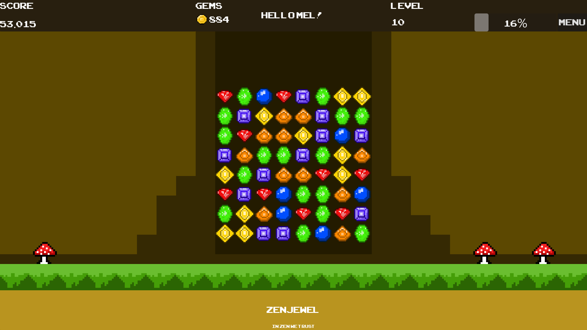

# ZenJewel

A relaxing match-3 puzzle game built with Godot 4. No timers, no lives, no stress.
Just play, match, and collect gems at your own pace.

<p align="left">
  
  
  
  
  
  
</p>

---

## Preview



## About

ZenJewel is a solo indie project built as a portfolio piece demonstrating full-stack game development: core engine programming, game systems design, pixel art, and original music production.

The design philosophy is **Zen Mode only**. No losing conditions, no time pressure. The player collects score and gems by matching jewels, levels up through score thresholds, and uses gems to unlock cosmetics in the in-game shop.

> All visual assets and music are currently in development. The screenshots and audio in this README will be updated as production progresses.

---

## Features

**Gameplay**

- 8×8 match-3 board with cascade combos and gravity
- Safe board generation (no matches on start)
- Combo multiplier system

**Special Jewels** created automatically through larger matches

- Line H/V (4-match) clears an entire row or column
- Bomb (5-match) clears a 3×3 area
- Color/Rainbow (6+-match) clears all jewels of the same type

**Progression**

- Level system with scaling score goals (×1.4 per level)
- Gem currency collected through matches
- Persistent save: score, level, currency and player name

**Visual & Audio** _(in development)_

- Line flash, bomb burst and jewel highlight effects
- Original soundtrack produced in FL Studio
- Original pixel art assets created in Aseprite

**Cosmetics & Shop** _(planned)_

- Board frame, background, ground and decoration customization
- Alternative jewel skin themes
- All cosmetics are purely visual, no gameplay advantage

---

## Tech Stack

| Tool               | Purpose                |
| ------------------ | ---------------------- |
| Godot 4 (GDScript) | Engine and scripting   |
| Aseprite           | Pixel art assets       |
| FL Studio          | Music and sound design |
| Affinity Designer  | UI layout and mockups  |
| VS Code            | Code editing           |

---

## Project Structure

```
res://
├── assets/
├── scene/
│   ├── main_menu.tscn    Start screen
│   ├── main.tscn         Main game scene
│   ├── jewel0-5.tscn     Standard jewel scenes
│   ├── jewel_bomb.tscn   Special jewel scenes
│   ├── jewel_line_h.tscn
│   ├── jewel_line_v.tscn
│   ├── jewel_color.tscn
│   └── ui.tscn           HUD and overlay UI
└── script/
    ├── board.gd           Board coordinator
    ├── board_effects.gd   Visual effects
    ├── board_gravity.gd   Falling and refill logic
    ├── board_ui_bridge.gd UI and LevelManager connection
    ├── match_finder.gd    Pure match detection logic
    ├── special_handler.gd Special jewel activation
    ├── special_types.gd   Shared Special enum
    ├── jewel.gd           Jewel data and input
    ├── level_manager.gd   Score, level, currency (Autoload)
    ├── ui.gd              Menu overlay logic
    └── main.gd            Scene root and positioning
```

---

## Architecture

ZenJewel uses composition over inheritance. `board.gd` acts as a coordinator and delegates to specialized modules:

```
board.gd  (coordinator)
├── match_finder.gd     stateless pure logic, receives grid, returns matches
├── special_handler.gd  activation logic for all 4 special types
├── board_effects.gd    visual only, ColorRect and Tween effects
├── board_gravity.gd    falling animation and refill
└── board_ui_bridge.gd  connects LevelManager signals to UI labels

LevelManager  (Autoload)
└── saves and loads score, level, gems, player name to user://save.json

SpecialType   (global class_name)
└── single source of truth for the Special enum
```

---

## Planned Features

- Highlights screen (personal bests: highest score, longest combo, biggest match)
- In-game cosmetics shop with gem currency
- Modular diorama system for board decoration
- Skin manager for full visual theme switching

---

## License

This project and all its assets (code, art, music) may not be copied, modified,
distributed or used without explicit written permission from the author.

Built with [Godot Engine](https://godotengine.org) (MIT License).
